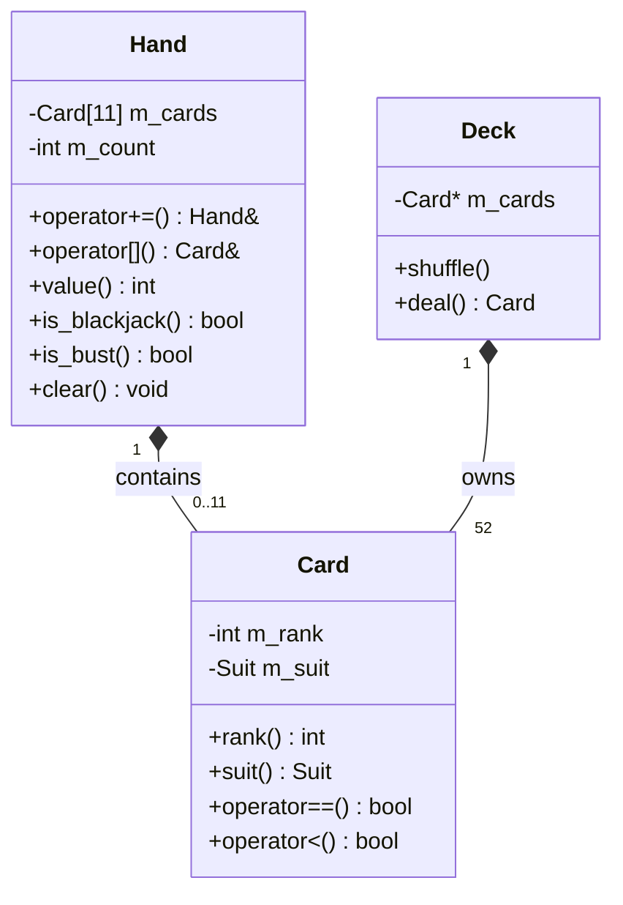

# Class diagram

```mermaid
classDiagram
  class Card {
    -int m_rank
    -Suit m_suit
    +rank() int
    +suit() Suit
    +operator==() bool
    +operator<() bool
  }
  class Hand {
    -Card[11] m_cards
    -int m_count
    +operator+=() Hand&
    +operator[]() Card&
    +value() int
    +is_blackjack() bool
    +is_bust() bool
    +clear() void
  }
  class Deck {
    -Card* m_cards
    +shuffle()
    +deal() Card
  }
  Hand "1" *-- "0..11" Card : contains
  Deck "1" *-- "52" Card : owns
```
