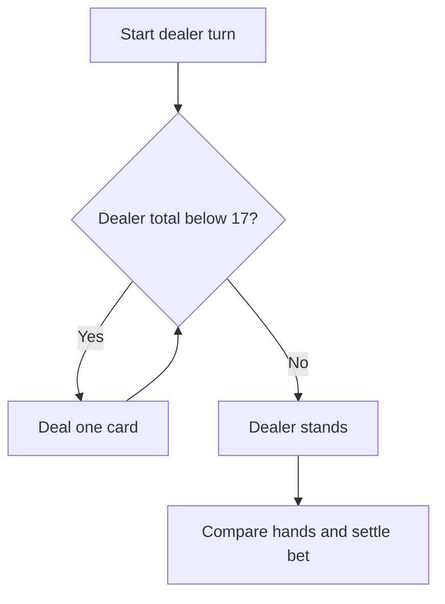

# Dealer turn

```mermaid
flowchart TD
  A[Start dealer turn] --> B{Dealer total below 17?}
  B -->|Yes| C[Deal one card]
  C --> B
  B -->|No| D[Dealer stands]
  D --> E[Compare hands and settle bet]
```
