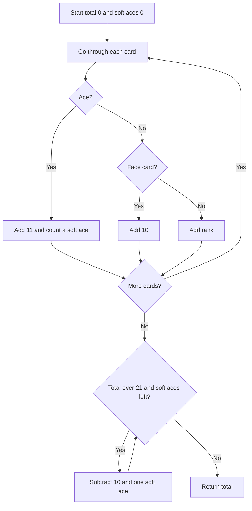

# How I calculate the hand value

```mermaid
flowchart TD
  A[Start total 0 and soft aces 0] --> B[Go through each card]
  B --> C{Ace?}
  C -->|Yes| D[Add 11 and count a soft ace]
  C -->|No| E{Face card?}
  E -->|Yes| F[Add 10]
  E -->|No| G[Add rank]
  D --> H{More cards?}
  F --> H
  G --> H
  H -->|Yes| B
  H -->|No| I{Total over 21 and soft aces left?}
  I -->|Yes| J[Subtract 10 and one soft ace]
  J --> I
  I -->|No| K[Return total]
```
